# OAL NETWORK — COMPLETE FLOW SPECIFICATION

**Version:** 1.0 (Draft) | **Date:** 08 October 2026  
**Companions:** `OAL_Network_PRD.md` and `OAL_Network_Complete_Wireframe.md`  
**Stack:** React.js + Tailwind CSS (frontend); backend/API architecture to be finalized.

> **Source fidelity:** Based on requirements summarized from six client DOCX documents in the prior conversation and the two existing project specifications. Original DOCX files were not accessible for line-by-line revalidation in this run. `[SOURCE-SUMMARY]` = reported client requirement; `[DESIGN]` = recommended implementation; `[VERIFY]` = client decision pending. Never treat `[DESIGN]` as confirmed client instruction.

## 1. Master end-to-end journey [SOURCE-SUMMARY]

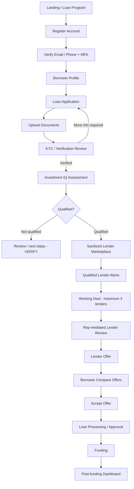

**Invariant:** The loan application is the central record; every subsequent object references it.

## 2. User role routing

| Role | Entry | Main navigation | Key boundary |
|---|---|---|---|
| Visitor | `/` | Programs, How It Works, IQ, Help Desk, Auth | No private data |
| Borrower | `/borrower` | Dashboard, Applications, Documents, IQ, Offers, Messages, Timeline | Own applications only |
| Lender | `/lender` | Qualified Leads, Network Panel, Working Deals, Offers, Reports | No other lender identities |
| OAL Rep | `/rep` | Leads, Requests, Communication, Offers (view-only), Reports | Cannot edit lender offers |
| Admin | `/admin` | Applications, KYC, Scoring, Distribution, Users, Tickets, Audit | Privileged actions audited |
| Help Desk | `/support` | Tickets, Knowledge Base, Routing | Scoped ticket access |
| Investor Club | `/investment-club` | Club info | Separate login/role `[VERIFY]` |

Routes are `[DESIGN]`, role capabilities reflect `[SOURCE-SUMMARY]`.

## 3. Public website → registration

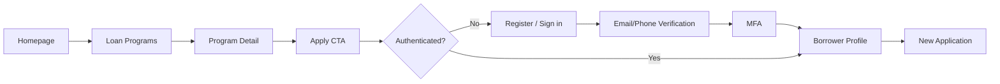

**Screens:** landing, loan-category listing/detail, register, login, verify contact, MFA, onboarding.  
**Validation:** email/phone uniqueness, password policy, verification expiry and recovery `[DESIGN]`.  
**Client decisions:** public sitemap wording, registration approval, exact identity verification method `[VERIFY]`.

## 4. Borrower application wizard

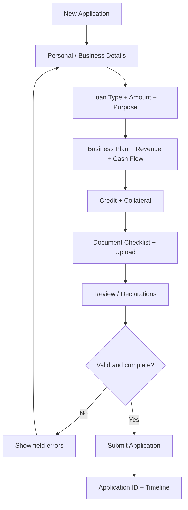

**Proposed UI steps** `[DESIGN]`; exact questions depend on original forms `[VERIFY]`.  
**Recommended application states:** `DRAFT`, `SUBMITTED`, `NEEDS_INFORMATION`, `UNDER_REVIEW`, `WITHDRAWN`. Do not hardcode these as final client terminology until confirmed.

**Acceptance:** Save/resume draft `[DESIGN]`; upload progress; required field validation; server-generated application ID; submission timestamp; borrower ownership enforcement.

## 5. Documents + KYC

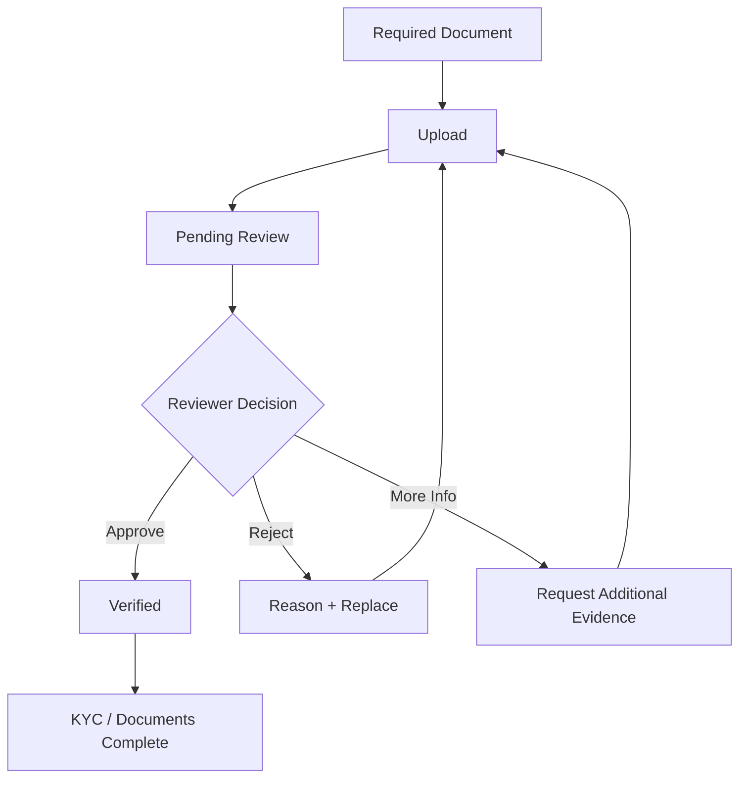

**Actors:** borrower uploads; authorized verification staff/admin reviews.  
**States** `[DESIGN]`: `REQUIRED`, `UPLOADED`, `IN_REVIEW`, `VERIFIED`, `REJECTED`.  
**Security:** signed document access, file validation, virus scanning, access logging `[DESIGN]`.  
**Pending:** mandatory document list by loan type, provider, retention rules `[VERIFY]`.

## 6. Investment IQ scoring

| Category | Maximum |
|---|---:|
| Credit History | 70 |
| Business Plan | 20 |
| Cash Flow | 50 |
| Collateral | 30 |
| Overall Risk Assessment | 10 |
| **Total** | **180** |

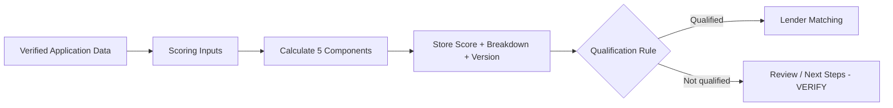

**Hard rule:** do not invent formulas or qualification cutoffs. Credit bands, financial scoring formulas, overrides and manual review are `[VERIFY]`. Scoring is not a loan approval guarantee.

## 7. Lender matching → marketplace

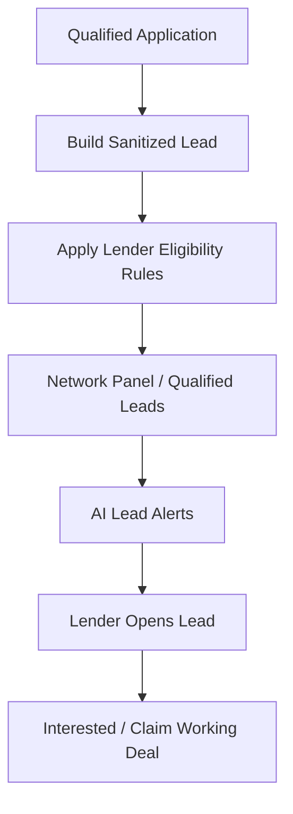

**Lender can see:** application reference, relevant program/amount, approved business summary, allowed IQ indicators and activity status.  
**Lender cannot see by default:** private PII, other lenders' names, unapproved documents or borrower contact information.  
**Pending:** exact matching algorithm, visibility rules and alert channels `[VERIFY]`.

## 8. Working Deal: maximum 3 concurrent lenders [CRITICAL]

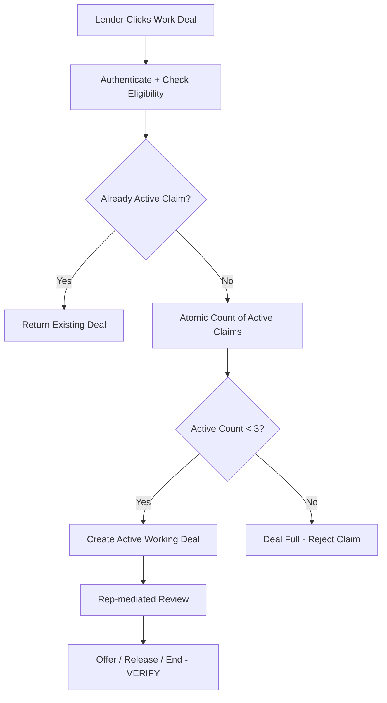

**Backend pseudocode** `[DESIGN]`:

```text
BEGIN TRANSACTION
  lock application claim scope
  assert lender is eligible
  if active claim for (application, lender): return existing claim
  if active_claim_count(application) >= 3: reject with DEAL_FULL
  create active claim
COMMIT
```

**Test:** with four simultaneous eligible requests, at most three active claims exist.  
**Pending:** claim expiration, release, reassignment, what happens on offer submission `[VERIFY]`.

## 9. Controlled communication

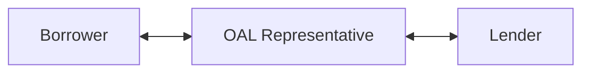

**Explicit restriction:** No direct Borrower ↔ Lender conversation `[SOURCE-SUMMARY]`.  
**Channels:** Rep–Lender chat/email/SMS are referenced; exact channel permissions and integration providers `[VERIFY]`.  
**Implementation:** server authorizes participant pairs; store message metadata; hide sensitive identities.

## 10. Offer creation → acceptance

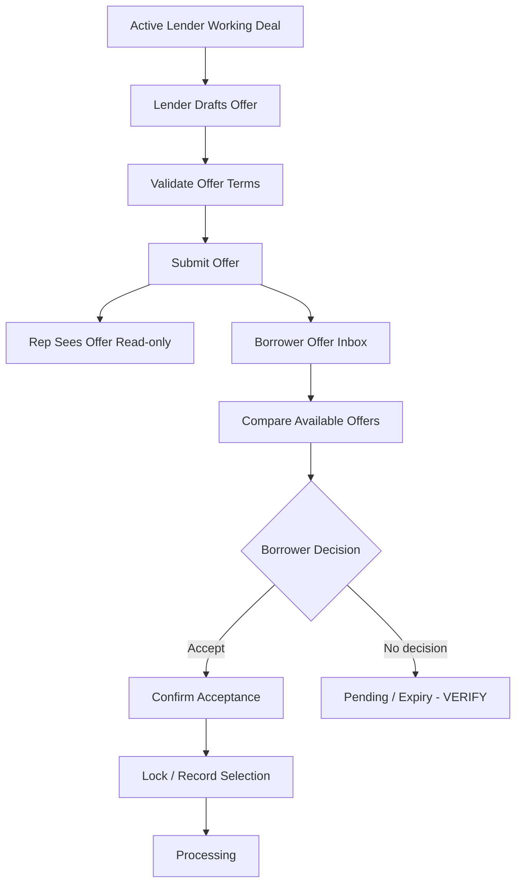

**Role permissions:**

| Action | Borrower | Lender | OAL Rep | Admin |
|---|---|---|---|---|
| View eligible own offers | Yes | Own submitted offers | Authorized read-only | Scoped `[VERIFY]` |
| Create/edit lender offer | No | Own offer only | **No** | `[VERIFY]` |
| Accept offer | Own application | No | No | `[VERIFY]` |

**Pending:** mandatory offer fields, multiple acceptances, revisions, expiration, withdrawals `[VERIFY]`.

## 11. Processing → funding → post-funding

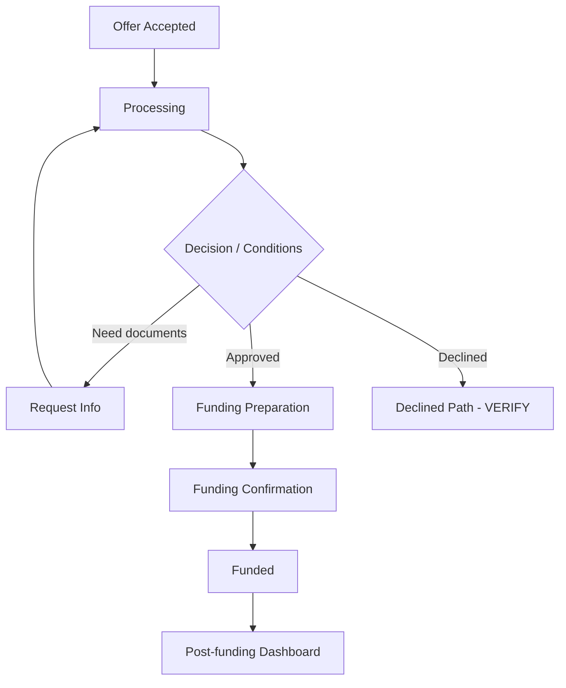

**Proposed statuses** `[DESIGN]`; processing owners, approval rules, funding method, actual disbursement integration and repayment servicing `[VERIFY]`. Do not mark funded from a frontend click alone.

## 12. Borrower Loan Process Chart

Display a timeline from registration and application submission to scoring, lender review, offers, processing and funding. Each event should include **event name, actor, timestamp, status and next action** `[DESIGN]`.

**Critical implementation detail:** use backend status events, not manually maintained UI percentages. Show branch states such as missing documents, withdrawal and rejection only after client approves the lifecycle.

## 13. OAL Representative workflow

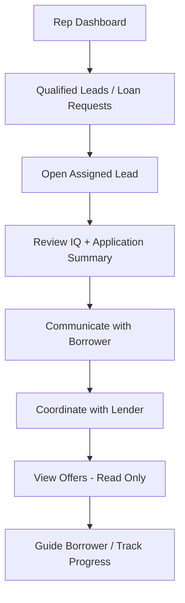

**Additional modules:** saved leads, analytics, reports, billing, subscription, profile and settings.  
**Pending:** assignment ownership, lead/request tab semantics, subscription access `[VERIFY]`.

## 14. Lender workflow

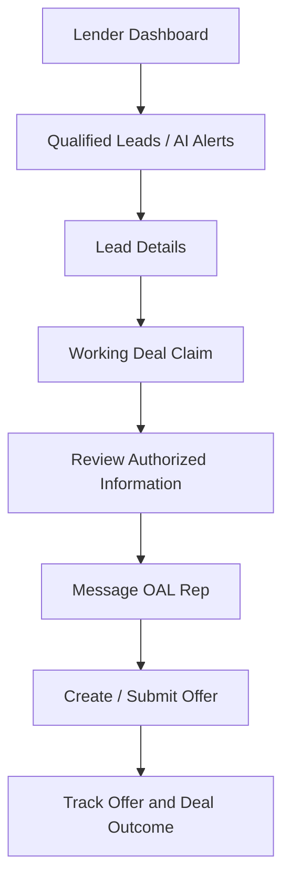

**Other modules:** Network Panel, borrower rankings/IQ, saved leads, analytics, reports, billing, subscription, profile and settings. No lender-to-lender identity exposure.

## 15. Admin workflow

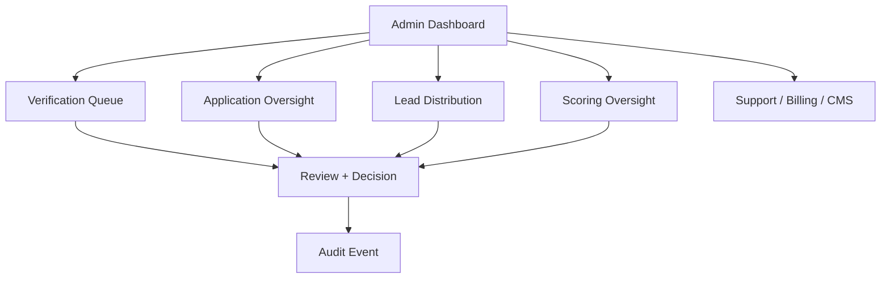

**Admin modules:** Borrowers, Lenders, Applications, Verification, Documents, Scoring Engine, Lead Distribution, Notifications, Referrals/Affiliates, Ads, Payments, Subscriptions, CMS, Reports, Tickets, Audit Logs, System Settings and Super Admin. Detailed edit rights `[VERIFY]`.

## 16. Help Desk workflow

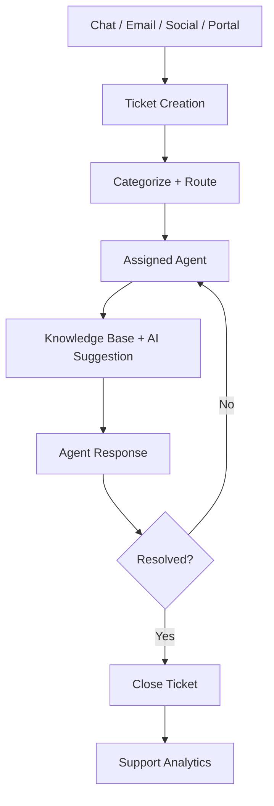

AI suggestions should be reviewed by a person before sending `[DESIGN]`. Exact channels, SLAs and automatic routing rules `[VERIFY]`.

## 17. Investment Club classification — unresolved

Prior document summary lists:
- VIP Diamond Club: `175+ LINV IQ`
- MVP Money Club: `140–164`
- OAL Club: `59+`
- Team Get Money: `0–58`

**BLOCKER:** The listed bands overlap (`59+` with higher tiers) and do not explicitly allocate `165–174`. **Do not silently correct these values.** Confirm the intended tiers and whether LINV IQ is different from borrower Investment IQ before building an automatic classification system. Accredited-investor checks are separate and cannot be inferred from the score.

## 18. Cross-cutting state and notification flow [DESIGN]

For every business transition:

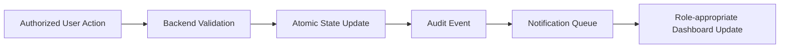

**Typical events:** `APPLICATION_SUBMITTED`, `DOCUMENT_REJECTED`, `KYC_VERIFIED`, `IQ_SCORED`, `LEAD_PUBLISHED`, `DEAL_CLAIMED`, `OFFER_SUBMITTED`, `OFFER_ACCEPTED`, `FUNDING_CONFIRMED`, `TICKET_ASSIGNED`. Event names are proposed.

## 19. UI route → workflow map [DESIGN]

| Page | Route | Action | Next page |
|---|---|---|---|
| Public landing | `/` | Apply | `/register` or `/login` |
| Borrower onboarding | `/borrower/onboarding` | Complete profile | `/borrower/applications/new` |
| New application | `/borrower/applications/new` | Save / submit | `/borrower/applications/:id` |
| Application details | `/borrower/applications/:id` | Upload / track | `/borrower/documents`, `/borrower/timeline` |
| Investment IQ | `/borrower/investment-iq` | View breakdown | Application status |
| Lender leads | `/lender/leads` | Open lead | `/lender/leads/:id` |
| Lender lead | `/lender/leads/:id` | Work Deal | `/lender/working-deals/:id` |
| Lender deal | `/lender/working-deals/:id` | Create offer | `/lender/offers/new` |
| Borrower offers | `/borrower/offers` | Compare / accept | `/borrower/offers/:id` |
| Rep workspace | `/rep/leads` | Coordinate | `/rep/messages` |
| Admin verification | `/admin/verifications` | Approve / reject | Application timeline |
| Help Desk | `/support/tickets` | Create / manage ticket | `/support/tickets/:id` |

## 20. Edge cases and backend rules

1. Duplicate submission: idempotent application submit; no duplicate application creation `[DESIGN]`.
2. Two simultaneous third-slot claims: one wins, the other receives `DEAL_FULL`.
3. Lender loses eligibility: do not reveal additional application data; claim treatment `[VERIFY]`.
4. Rep attempts offer edit: backend `403 Forbidden`.
5. Borrower accesses another borrower's record: backend `403/404` per security policy.
6. KYC rejection: request correction without exposing review-only notes.
7. IQ recalculation: version the score and preserve history `[DESIGN]`.
8. Offer expired or withdrawn: cannot accept.
9. Borrower tries direct lender messaging: reject on server.
10. Funding fails: do not show `FUNDED` until verified confirmation.
11. Notification delivery failure: business transaction remains authoritative; retry notification.
12. Deactivated user: revoke sessions and block protected actions.

## 21. Implementation order

| Phase | Build | Completion gate |
|---|---|---|
| 0 | Confirm source DOCX, sitemap, linked references and open questions | Client-approved baseline |
| 1 | React app shell, Tailwind tokens, auth, RBAC | Role isolation |
| 2 | Borrower profile, application wizard, documents, KYC | Submission walkthrough |
| 3 | Investment IQ UI + scoring backend | Formula verification |
| 4 | Marketplace, network panel, alerts, working-deal cap | Privacy + concurrency tests |
| 5 | Rep-mediated messaging | No direct borrower–lender path |
| 6 | Offer management and acceptance | Read-only rep / acceptance tests |
| 7 | Processing, funding and timeline | Verified state transitions |
| 8 | Admin, Help Desk, billing/CMS/referrals after rule approval | Admin UAT |
| 9 | Responsive QA, security review, UAT | Client sign-off |

## 22. Client confirmations required before calling this exact

- Original public sitemap, all PDF/DOCX embedded links and brand assets.
- Exact loan application field set per loan program.
- KYC provider and document checklist.
- Credit/cash flow scoring formulas and qualification threshold.
- Lender matching rules, claim release and claim timeout.
- Lender vs Rep access to Loan Requests and Saved Leads.
- Offer fields, acceptance policy, expiration and revision rules.
- Official processing/funding status names and owners.
- Correct Investment Club score bands and investor/borrower IQ distinction.
- Billing, subscription, referral, ad and Help Desk operational rules.
- Jurisdiction, privacy, retention and financial compliance requirements.

---

**Implementation principle:** `Borrower → Loan Application → Verification → IQ → Qualified Marketplace → ≤3 Working Lenders → Rep-mediated Review → Offers → Borrower Acceptance → Processing → Funding`. Keep this as one auditable lifecycle with server-side permissions and atomic business rules.
