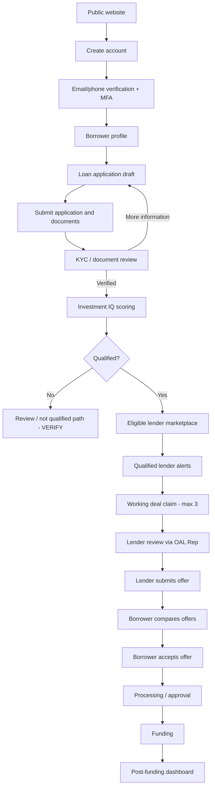

# OAL Network — Product Requirements Document (PRD)

**Version:** 1.0 — Draft for client validation  
**Date:** 08 October 2026  
**Product:** OAL Network — Loan Application & Lending Marketplace  
**Frontend:** React.js (Vite) + Tailwind CSS  
**Companion:** `OAL_Network_Complete_Wireframe.md`

> **Source accuracy:** This PRD is grounded in the six uploaded OAL documents **as summarized earlier in this conversation** and the existing wireframe specification. The original DOCX files were not available for a fresh line-by-line verification while producing this PRD. Accordingly, this is **not a certified verbatim client PRD**. **[SOURCE-SUMMARY]** means supported by the earlier document analysis; **[DESIGN]** means implementation proposal; **[VERIFY]** means confirm against original documents/client before build.

---

## 1. Product vision

Build a secure, multi-role loan application and lender marketplace platform connecting borrowers, OAL representatives/agents and eligible lenders through an auditable application-to-funding workflow. This is **not merely a CRM**. The central business object is the **Loan Application**, which moves through identity verification, documentation, Investment IQ assessment, lender discovery, working deals, offers, processing and funding. [SOURCE-SUMMARY]

### 1.1 Primary outcomes
- Borrowers can register, apply, upload evidence, see their Investment IQ, track loan progress, review offers and accept one.
- Lenders can discover eligible anonymized applications, claim a limited working-deal slot and create/manage their own offers.
- OAL representatives mediate borrower–lender communications and have **read-only** offer access.
- Administrators oversee users, verifications, applications, lender distribution, scoring, support, subscriptions, reporting and audit activity.
- Help Desk provides tickets, knowledge resources, routing and support analytics.

### 1.2 Out of scope until confirmed
Direct loan origination/disbursement by OAL, bank transfer execution, underwriting guarantees, legally binding e-signature, credit-bureau integrations, automated investment accreditation and repayment servicing are **not assumed**. [VERIFY]

---

## 2. Roles and authorization

| Role | Main responsibilities | Non-negotiable restrictions |
|---|---|---|
| Public visitor | View website, loan programs, informational pages, start registration | No private application data |
| Borrower | Manage own application, documents, IQ, offers, messages with representative | No direct borrower–lender chat |
| Lender | Browse qualified marketplace profiles, claim working deal, review permitted information, submit own offers | Other lenders' identities hidden; no unrestricted PII |
| OAL Representative / Agent | Manage leads and mediate messages, view offer results, reports, billing | **Cannot edit lender offers** |
| Admin / Super Admin | Review, verify, distribute, administer, report and audit | Elevated actions must be permission-checked and logged |
| Help Desk staff | Handle support tickets and knowledge content | Only permitted ticket/customer data |
| Investor / Club member | Investment Club content / classification | Separate portal/login **[VERIFY]** |

**Security invariant:** enforce authorization on every backend request; frontend menu visibility is not authorization. [DESIGN]

---

## 3. Information architecture

### 3.1 Public website
Home, Loan Programs, program details, How It Works, Investment IQ explainer, Investment Club, Help Desk/FAQ, Login, Register. Proposed public menu and copy are [DESIGN]; sitemap labels must be compared with the original sitemap [VERIFY].

**Loan programs mentioned in the source summary:** Restaurant, Food Truck, Franchise, Dental Practice, General Freight/Trucking, Hotel/Motel/Airbnb, Church, Fix & Flip. Additional categories [VERIFY].

### 3.2 Borrower navigation
Dashboard; Loan Process Tracker; My Applications; New Application; Documents; Investment IQ; Offers; Messages; Notifications; Referrals; Profile; Settings; Help Desk.

### 3.3 Lender navigation
Dashboard; Network Panel; Qualified Leads; AI Lead Alerts; Borrower Rankings/Investment IQ; Lead Details; Loan Requests; Saved Leads; Working Deals; Offer Management; Messages; Notifications; Analytics; Reports; Billing; Subscription; Profile; Settings.

### 3.4 OAL representative navigation
Dashboard; Qualified Leads; AI Lead Alerts; Lead Details; Loan Requests; Saved Leads; Communication; Offer Management (**view only**); Analytics; Reports; Billing; Subscription; Profile; Settings.

### 3.5 Admin navigation
Dashboard; Network Panel; Borrowers; Lenders; Loan Applications; AI Scoring Engine; Verification Center; Document Management; Lead Distribution; Notifications; Referrals & Affiliates; Advertisements; Payments; Subscription Plans; CMS; Reports & Analytics; Support Tickets; Audit Logs; System Settings; Super Admin. Representative management [VERIFY].

---

## 4. End-to-end borrower-to-funding journey

The precise status vocabulary, qualifications, denial handling, funding events and transition owners require [VERIFY].

---

## 5. Functional requirements and acceptance criteria

### FR-01 — Registration, verification and access [SOURCE-SUMMARY]
**Requirement:** Account creation with legal name, email, phone, password, verification and MFA; role-specific dashboards.

**Acceptance:**
- A new user cannot access protected application routes before required authentication steps.
- Login, logout, reset password, verification failures and expired sessions have clear UI states. [DESIGN]
- Users cannot self-assign Admin/Super Admin. [DESIGN]
- Role approval and invite rules [VERIFY].

### FR-02 — Borrower profile and dashboard [SOURCE-SUMMARY]
**Requirement:** Display application status, IQ score, loan process chart, lender activity count, offers, notifications, messages and referrals.

**Acceptance:**
- Dashboard data is scoped to authenticated borrower.
- No lender contact details are exposed.
- Empty/loading/error states are present. [DESIGN]

### FR-03 — Loan application [SOURCE-SUMMARY; grouping DESIGN]
**Proposed wizard steps:**
1. Borrower and business identity.
2. Loan type, requested amount, loan purpose.
3. Business plan, revenue, cash flow, credit information.
4. Collateral (property/equipment/inventory, when applicable).
5. Supporting documents and KYC.
6. Review, declarations and submission.

**Acceptance:**
- Validation is clear and field-specific.
- Save/resume draft [DESIGN].
- Submission creates a unique application record with immutable submission timestamp.
- Loan purpose **20 words or fewer where required by source scoring form**; exact applicability [VERIFY].
- Program-specific conditional fields [VERIFY].

### FR-04 — Document management and KYC [SOURCE-SUMMARY]
**Requirement:** Upload, classify, review and track verification of required documents.

**Proposed states:** Required, Uploaded, Under Review, Verified, Rejected, Needs Replacement. [DESIGN]

**Acceptance:**
- Only authorized roles can view/download documents.
- Reviewer actions and rejection reasons are logged.
- Upload file types, sizes, retention and KYC provider [VERIFY].

### FR-05 — Investment IQ [SOURCE-SUMMARY]
**Score maximum: 180 points.**

| Component | Max points |
|---|---:|
| Credit History | 70 |
| Business Plan | 20 |
| Cash Flow | 50 |
| Collateral | 30 |
| Overall Risk Assessment | 10 |
| **Total** | **180** |

**Acceptance:**
- Store component scores, total, explanation, calculation timestamp and scoring version.
- Total equals sum of valid component scores and is within 0–180.
- Display scoring breakdown to permitted users.
- Credit bands, formulas, source fields, manual overrides and qualification thresholds [VERIFY].
- Score is **not** represented as automatic credit approval. [DESIGN]

### FR-06 — Qualified marketplace and AI lead alerts [SOURCE-SUMMARY]
**Requirement:** Qualified applicants become visible to appropriate lenders, with AI-based alerts.

**Acceptance:**
- Marketplace list includes only authorized, permitted fields.
- Lenders see anonymized borrower summaries, not sensitive personal data.
- Matching/alert eligibility is recorded and traceable.
- Matching logic and minimum score [VERIFY].

### FR-07 — Network Panel [SOURCE-SUMMARY]
**Requirement:** Live marketplace/activity panel, new applicant indication, timestamps, progress and lender anonymity.

**Acceptance:**
- Events have timestamps.
- Other lenders' identities are never revealed.
- Realtime implementation via polling/WebSocket/SSE [DESIGN].

### FR-08 — Working Deal limit [SOURCE-SUMMARY; CRITICAL]
**Requirement:** No more than **3 lenders simultaneously** working one application.

**Acceptance:**
- First three eligible claims may succeed; fourth must fail.
- Server uses atomic transaction/locking to prevent race conditions.
- UI shows remaining slots without revealing competing lender identities.
- Claim release, timeout, withdrawal and re-entry [VERIFY].
- Claiming does not automatically reveal all sensitive files.

### FR-09 — Mediated communication [SOURCE-SUMMARY; CRITICAL]
**Requirement:** Borrower ↔ OAL Representative ↔ Lender. Lender–representative channels may include chat, email and SMS.

**Acceptance:**
- Borrower cannot start a direct conversation with lender.
- Representative can communicate with both sides within authorized scope.
- Message events and delivery history are auditable.
- Email/SMS providers and message retention [VERIFY].

### FR-10 — Offer management [SOURCE-SUMMARY]
**Requirement:** Lender creates/updates/submits own offer; OAL Rep views but **cannot edit**; borrower can compare and accept offers.

**Acceptance:**
- Rep edit APIs return forbidden.
- Lender may edit only permitted own offers in permitted states.
- Borrower sees only offers available to their application.
- Offer acceptance requires explicit confirmation and server validation.
- Interest rate, amount, term, fees, expiration, counteroffers and multiple acceptance rules [VERIFY].

### FR-11 — Loan Process Chart [SOURCE-SUMMARY]
**Requirement:** Automated visual application-to-funding progress.

**Proposed states [DESIGN]:** Draft → Submitted → KYC/Documents Review → Scored → Qualified → Lender Review → Working Deal → Offer Received → Offer Accepted → Processing → Approved → Funding → Funded.

**Alternate branches [DESIGN]:** Needs Information, Rejected, Withdrawn, Expired, Funding Failed.

**Acceptance:**
- Every state change has actor, timestamp, previous/new state and reason when relevant.
- Only authorized transitions succeed.
- Borrower sees understandable progress and next action.
- Final state names and transitions [VERIFY].

### FR-12 — Admin console [SOURCE-SUMMARY]
**Requirement:** User management, verification, documents, lead distribution, scoring oversight, payments/subscriptions, CMS, reporting, support and audit logs.

**Acceptance:**
- Admin dashboard contains actionable queues and filters.
- Privileged changes require backend permissions.
- Critical actions are auditable.
- Admin ability to edit offers/scoring thresholds [VERIFY].

### FR-13 — Help Desk [SOURCE-SUMMARY]
**Requirement:** Ticketing, centralized email/chat/social intake, automatic ticket creation, knowledge base/FAQ, AI suggestions, routing, collaboration and performance reporting.

**Acceptance:**
- Tickets have owner, status, category, priority and history. [DESIGN]
- AI-generated suggestions are reviewed before sending. [DESIGN]
- Channel integrations, SLAs and assignment rules [VERIFY].

### FR-14 — Investment Club / Money Club [SOURCE-SUMMARY]
**Stated bands in prior document analysis:**
- VIP Diamond Club: **175+ LINV IQ**
- MVP Money Club: **140–164**
- OAL Club: **59+**
- Team Get Money: **0–58**

**BLOCKER [VERIFY]:** As written, the ranges overlap and leave 165–174 unclassified. Clarify whether **LINV IQ** is a separate investor score from borrower **Investment IQ**. Do **not** automate exclusive club assignment until corrected. Accredited investor status must be verified independently, not inferred from score.

### FR-15 — Billing, subscriptions, referrals, ads and CMS [SOURCE-SUMMARY]
Modules are listed in the documents, but detailed pricing, payment lifecycle, eligibility, commission, ad placement, CMS publishing roles and subscription limits are [VERIFY]. Build UI shells only after rules are defined.

---

## 6. Core data model [DESIGN]

Suggested entities:

| Entity | Key relationships / purpose |
|---|---|
| User | Identity, auth state, roles |
| BorrowerProfile / LenderProfile / RepProfile | Role-specific profile data |
| LoanProgram | Program catalog and conditional requirements |
| LoanApplication | **Canonical aggregate root**; borrower, type, requested amount, status |
| ApplicationAnswer | Versioned field answers per program |
| Document | Owner, application, classification, storage pointer, review status |
| VerificationCase | KYC type, status, reviewer, evidence |
| InvestmentIQAssessment | Score total, component scores, version, explanation |
| MarketplaceListing | Sanitized lender-visible projection |
| LenderEligibility / Alert | Matching decision and delivery log |
| WorkingDeal | Application–lender claim, active/released timestamps |
| Offer | Lender-owned terms, status, revisions |
| OfferAcceptance | Borrower selection and timestamp |
| LoanStatusEvent | State-transition audit trail |
| Conversation / Message | Mediated participant channels |
| Notification | Event, recipient, delivery state |
| SupportTicket | Assignment, status, messages |
| Subscription / Payment | Billing module [VERIFY] |
| Referral | Attribution and status [VERIFY] |
| AuditLog | Actor, action, target, timestamp, metadata |

Use stable IDs, created/updated timestamps, logical ownership and access-control checks. Exact Prisma/MySQL schema is a separate technical deliverable. [DESIGN]

---

## 7. Suggested API boundaries [DESIGN]

- `POST /auth/register`, `/auth/login`, `/auth/verify`, `/auth/mfa`
- `GET/PATCH /me`
- `GET/POST /applications`, `GET/PATCH /applications/:id`, `POST /applications/:id/submit`
- `POST /applications/:id/documents`, `GET /applications/:id/documents`
- `GET /applications/:id/investment-iq`
- `GET /marketplace/leads`, `GET /marketplace/leads/:id`
- `POST /applications/:id/working-deals/claim`, `POST /working-deals/:id/release`
- `GET/POST /applications/:id/offers`, `PATCH /offers/:id`, `POST /offers/:id/submit`
- `POST /offers/:id/accept`
- `GET /applications/:id/timeline`
- `GET/POST /conversations`, `GET/POST /conversations/:id/messages`
- `GET/POST /support/tickets`
- Admin namespaces for verification, scoring oversight, distribution, reports and audit.

All endpoints need explicit roles, resource ownership, validation, pagination and error contracts. URLs are proposed, not source-specified.

---

## 8. React.js + Tailwind UI requirements [DESIGN]

**Stack:** React.js, Vite, Tailwind CSS, React Router, Lucide React. API-state management and form library to be selected during implementation.

### Theme tokens
| Token | Value | Use |
|---|---|---|
| Navy | `#0B1730` | Sidebar, hero |
| Navy Light | `#172B4D` | Dark panels |
| Royal Blue | `#2563EB` | Primary action |
| Muted Gold | `#D5B66A` | Premium accent |
| Teal | `#0D9488` | Success/verified |
| Amber | `#D97706` | Pending |
| Red | `#DC2626` | Error |
| Canvas | `#F8FAFC` | Page background |
| White | `#FFFFFF` | Cards |
| Slate | `#0F172A` | Primary text |

Brand colors are a **professional proposal**, not confirmed official OAL brand colors.

### Shared components
AppShell, Sidebar, Topbar, Breadcrumbs, KPI Card, DataTable, Search/Filters, StatusBadge, StatusTimeline, ApplicationWizard, FileUploader, IQBreakdown, MarketplaceLeadCard, WorkingDealSlots, OfferComparison, MessagingPanel, TicketQueue, Modal, Toast, Skeleton and EmptyState.

### Responsive requirements
- Desktop: expanded sidebar, data tables and multi-column dashboards.
- Tablet: collapsible sidebar and reduced grid columns.
- Mobile: drawer navigation, stacked cards, vertical stepper, usable comparison panels.
- Keyboard accessibility, labels, focus states, sufficient contrast and responsive validation errors.

### UI states required for every interactive page
Loading, empty, error, success, permission denied, stale/conflict, validation error and confirmation where action is consequential.

---

## 9. Non-functional requirements [DESIGN; targets to approve]

**Security:** HTTPS, server-enforced RBAC, encrypted sensitive storage, secure upload URLs, secret management, rate limiting, MFA, audit trails, privacy-preserving marketplace projections.

**Reliability:** Idempotent submission/acceptance actions; atomic working-deal cap; retryable notifications; safe concurrent updates.

**Performance:** Paginated tables and lazy routes; define page-load/API response targets after environment and traffic assumptions are confirmed.

**Accessibility:** Aim for WCAG 2.2 AA; confirm contractual accessibility standard.

**Privacy/compliance:** Data retention, consent, lending regulations, KYC/AML, privacy policy, security testing, credit-data permissions and jurisdictions require legal/client validation. This PRD does not assert compliance.

**Observability:** Application errors, auth failures, verification bottlenecks, claim conflicts, offer events, audit trail and support SLA metrics.

---

## 10. Analytics and success metrics [DESIGN]

Track registration completion, application start-to-submit conversion, KYC turnaround, document rejection rate, IQ scoring completion, qualified lead count, working-deal slot utilization, lender response time, offer rate, offer acceptance, time to funding, support resolution time and notification delivery success. Set baselines and numeric targets with client.

---

## 11. Delivery phases and release gates

| Phase | Scope | Exit gate |
|---|---|---|
| 0 — Discovery | Verify six original documents, links, sitemap, contradictions | Signed requirements baseline |
| 1 — Foundation | Auth, MFA, roles, shell, profiles, permissions | Role isolation tested |
| 2 — Borrower | Application wizard, drafts, documents, KYC UI | End-to-end submit + review |
| 3 — Scoring | 180-point breakdown, versioned assessments | Formula tests approved |
| 4 — Marketplace | Anonymized listings, alerts, network feed, 3-slot claims | Concurrency + privacy tests |
| 5 — Coordination | Rep mediation, messages, notifications | Direct borrower–lender messaging blocked |
| 6 — Offers | Lender offer management, rep read-only, borrower compare/accept | Permission + acceptance tests |
| 7 — Lifecycle | Processing, funding tracker, post-funding | Status transition tests |
| 8 — Operations | Admin, Help Desk, billing/CMS/referrals as confirmed | Admin UAT and audit review |
| 9 — Release | Security, accessibility, mobile QA, UAT | Client sign-off |

---

## 12. UAT scenarios (minimum)

1. Borrower signs up, verifies account and logs in with MFA.
2. Borrower saves, resumes and submits an application.
3. Required documents can be uploaded and reviewed; rejected file can be replaced.
4. IQ breakdown shows all five components and correct 180-point maximum.
5. Non-qualified or unverified application is not exposed to unauthorized lenders.
6. Lender sees anonymized listing only.
7. Three lenders claim one deal; fourth claim fails under simultaneous requests.
8. Lender A cannot identify Lender B through API or UI.
9. Borrower cannot initiate direct lender chat.
10. Rep can view but **cannot update** any lender offer, including by direct API call.
11. Borrower compares eligible offers and accepts only a valid offer.
12. Status timeline updates with correct actor and timestamp.
13. Borrower cannot access another borrower's application or files.
14. Admin verification decisions and sensitive actions appear in audit history.
15. Help Desk ticket assignment, message and closure flows work.
16. Mobile application, marketplace and offer screens remain usable.

---

## 13. Client clarification register — blockers before 'exact' build

| ID | Question | Why it matters |
|---|---|---|
| C01 | Confirm complete original sitemap labels and all links | Navigation fidelity |
| C02 | What is the exact borrower application field list by loan type? | Forms/schema |
| C03 | Which KYC checks, document types and provider? | Compliance/workflow |
| C04 | Full credit/financial IQ scoring formulas and score threshold? | Correct scoring |
| C05 | Is LINV IQ separate from Borrower Investment IQ? Correct club ranges? | Prevent wrong classification |
| C06 | What exactly qualifies a lender to receive an alert? | Matching engine |
| C07 | Working-deal claim expiration, release and reassignment policy? | Slot locking |
| C08 | Loan Requests vs Qualified Leads vs Saved Leads definitions? | Lender/Rep UX |
| C09 | Exact offer fields, edits, expiry, acceptance and withdrawal rules? | Transaction integrity |
| C10 | Final loan lifecycle statuses and who can advance each? | State machine |
| C11 | Which actions may Admin and OAL Rep perform in verification/scoring? | RBAC |
| C12 | Subscription pricing, payments, referrals and ads rules? | Commercial modules |
| C13 | Are Investor Club users a distinct portal role? | Architecture |
| C14 | Confirm official brand assets, colors and content | Visual fidelity |
| C15 | Confirm external reference URLs and permitted inspiration scope | Research / copyright |
| C16 | Required jurisdiction, data retention, lending and privacy controls? | Compliance |

**Do not label the system 100% exact or production-ready until C01–C16 are resolved and acceptance tests pass.**

---

## 14. Definition of Done

A feature is done only when:
- The implemented screen matches approved wireframe and role-specific navigation.
- All controls are connected to real API behavior (or clearly marked prototype).
- Backend validates identity, role, ownership and allowed state transitions.
- Loading, empty, error and success states exist.
- Key business actions generate audit events.
- Responsive, accessibility and security checks pass.
- Unit/integration/UAT scenarios pass.
- Client accepts the functionality against approved source requirements.

---

## 15. Reference documents and provenance

Documents named in the original request:
1. `OPM ASAP - Sitemap - website blueprint.docx`
2. `OAL Network - Q & C.docx`
3. `Help Desk – OAL Network.docx`
4. `INV IQ - OAL Network.docx`
5. `Investment IQ - Investment Club.docx`
6. `OAL Network portal - software.docx`

Companion design specification: `OAL_Network_Complete_Wireframe.md`.

**External references mentioned in the earlier summary:** elitefunders.com, lendio.com, nerdwallet.fundera.com, businessloans.com, sofi.com and biz2credit.com. Their current pages and the original embedded hyperlinks have **not been revalidated** for this PRD. Treat them as inspiration only, not permission to copy content/design.

**Approval status:** DRAFT — pending original-source audit and client sign-off.
